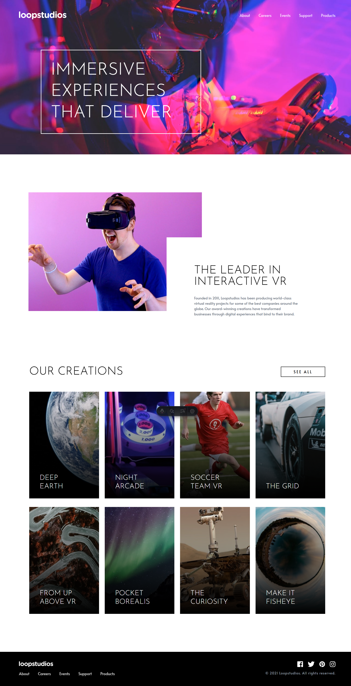

# 🏝️ Proyecto: Loopstudios Landing Page

Este proyecto consiste en el desarrollo de la **landing page de Loopstudios** utilizando **Astro** y **Tailwind CSS**.  
El objetivo es aplicar los conocimientos sobre **componentes de Astro**, **maquetación**, **estilos responsivos** y **utilidades CSS** para construir un diseño limpio, moderno y adaptable a diferentes dispositivos.

---

## 📖 Descripción general

### 🧩 Vista previa del proyecto

Agrega aquí una **captura de pantalla** del resultado final de tu landing page.

---

### 🔗 Enlaces del proyecto

- **Repositorio en GitHub:** [Link del repositorio](https://github.com/ArantzaGHdz/Ejercicio_Loopstudios-Landing-Page)
- **Sitio desplegado (opcional):** [Link del deploy](https://)

---

## 🧠 Proceso de desarrollo

### 🛠️ Tecnologías utilizadas

Lista las herramientas y tecnologías que utilizaste en el proyecto. Por ejemplo:

- [Astro](https://astro.build)
- [Tailwind CSS](https://tailwindcss.com/)
- HTML5 semántico
- Diseño responsivo (Mobile-first)
- Componentes de Astro reutilizables

---

### 💡 Lo que aprendí

Reforze mis conocimientos de HTML y CSS además de utilizar más clases de tailwind para copiar los diseños lo más parecido posible. También aprendí como realizar aplicar el diseño de manera responsiva para celular o pantallas con una resolución más pequeña y realizar menus desplegables utilizando solamente tailwind.

---

### 🚀 Áreas de mejora

Hay varias cosas que necesito practicar o mejorar para aplciarlos en futuros poryectos como: el manejo del diseño responsivo (tuve muchos problemas al intentar adaptar el diseño que hice primero para escritorio a pantallas más pequeñas), seguir practicando el uso de tailwind para manejarlo de forma más eficiente y al momento de hacer componentes de astro, tengo que pensar mejor en como se pueden implementar. Por ejemplo: la barra de navegación tiene la imagen de fondo principal, sin embargo, esto hace que su utilización en otras paginas del sitio web se vuelva complicado dado que la imagen siempre va a estar presente.

---

### 📚 Recursos útiles

- [Guía oficial de Tailwind CSS](https://tailwindcss.com/docs)
- [Guía de diseño responsivo](https://web.dev/responsive-web-design-basics/)

---

### 👩‍💻 Autor

- **Nombre completo:** Arantza Darina Gómez Hernández
- **Carrera:** Ingeniería en Tecnologías de la Información y las Comunicaciones
- **Grupo:** TC1
- **Correo institucional:** 23151198@aguascalientes.tecnm.mx

---

### ✨ Reflexión final

- ¿Qué fue lo más fácil o lo más difícil de realizar?
  Lo más dificil fue la modificación del diseño para hacerlo responsivo en celulares.

- ¿Qué parte disfrutaste más del desarrollo?
  En general, fue el diseño de la página; aunque si tuviera que mencionar una parte de este en especifico, fue el catalogo de imagenes.

- ¿Qué conceptos nuevos aprendiste?
  Diseño responsivo y nuevas clases de Tailwind

- ¿Cómo aplicarías lo aprendido en proyectos futuros?
  Ahora tengo más conocimientos sobre el diseño y uso de componentes de Astro, además de un poco de prácitca para el diseño responsivo enfocado a distintos tamaños de pantalla.
